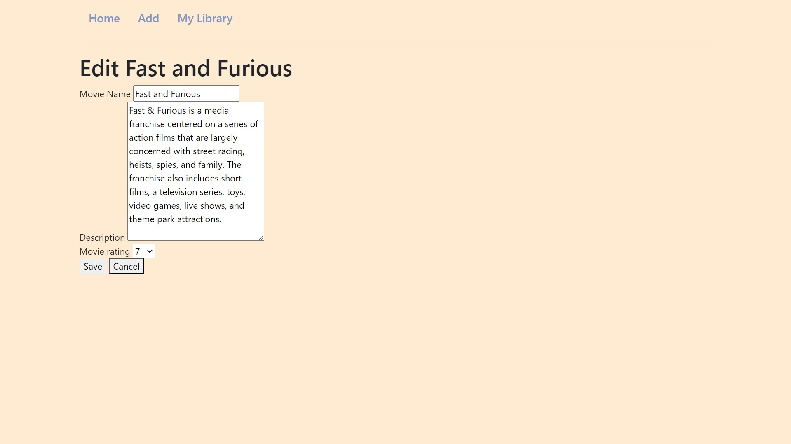

# Movie DB with SQLAlchemy

## Table of contents

- [Overview](#overview)
    - [Functionality](#functionality)
    - [Screenshots](#screenshots)
- [My process](#my-process)
    - [Built with](#built-with)
    - [What I learned](#what-i-learned)
    - [Continued development](#continued-development)

## Overview

### Functionality
Allows the user to 
- Add a Movie to the database.
- Edit the Movie in the database.
- Delete a Movie from the database.
- View the movies listed in the database.

### Screenshots
Homepage

Adding a movie

Editing a movie

Movie details

## My process

### Built with
- Flask
- SQLAlchemy
- SQLite
- HTML, CSS

### Future development
- Make a form that takes in a movie name.
Then I would pass the POST request and search for the
movie in the database. Return the list of movies that have
matching words with the request.

- Can add a feature that allows a user to `add` a movie
from the external database to this database. This would
utilize some movie database API.

- Add user authentication so everyone can have their own
personalized list.

- List movies in the order ranked/ release date.
